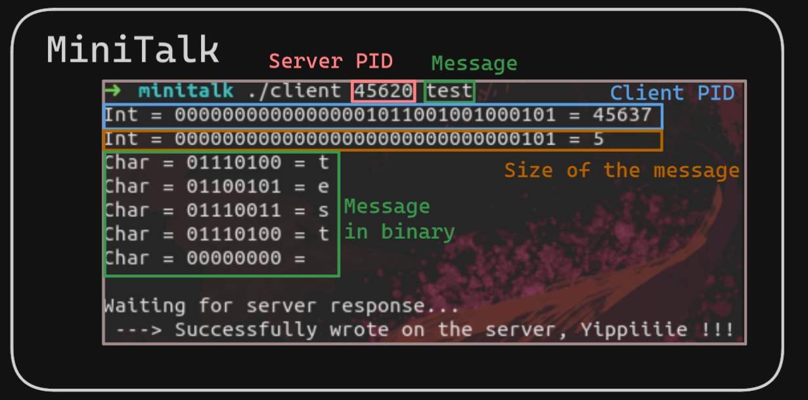

# minitalk ✅125/100
A simple server & client program

First use of the UNIX signals

The server display his PID and wait for a message to display from the client

The message is sent using only SIGUSR1 & SIGUSR2 as binary

- 

- 
